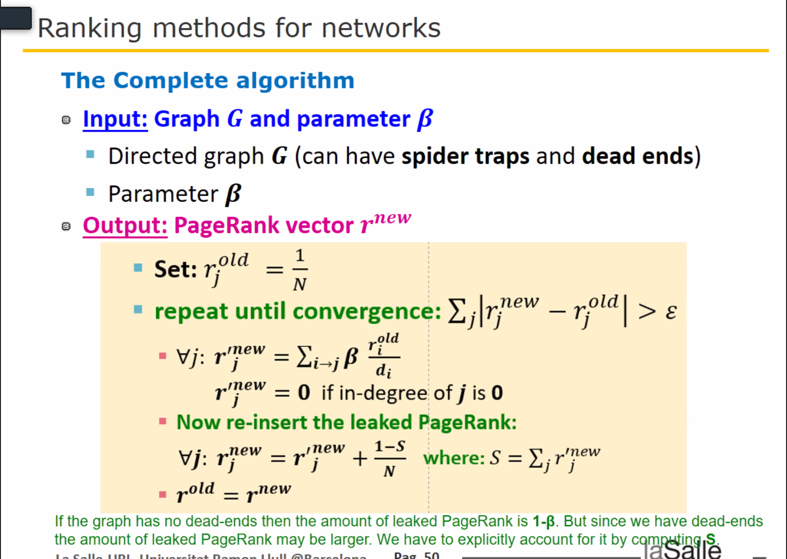

# Practical Assignment 1 - PageRank Algorithm

_Data Mining | La Salle Campus Barcelona_

_Javier Mérida, October 22, 2021._

________

## Introduction
In this assignment we are studying the PageRank algorithm:

_PageRanks is a link analysis algorithm and it assigns a numerical weighting to each element of a hyperlinked set of
documents, such as the World Wide Web, with the purpose of "measuring" its relative importance within the
set._ ([Wikipedia](https://en.wikipedia.org/wiki/PageRank))

 
Furthermore, we are applying the algorithm to the dataset found in [gr0.California.txt](gr0.California.txt), which follows 
this structure (space separated):

**From line 0 to 9664:**

| n | Page ID | Page URL     |
|---|---------|--------------|
| n | 0       | example.com  |
| n | 1       | example2.net |
| n | 2       | another.gov  |


_First column has a letter `n` to differentiate this section_


**From line 9665 to 25815:**

| e | From (ID) | To (ID) |
|---|-----------|---------|
| e | 0         | 2       |
| e | 2         | 1       |
| e | 1         | 0       |


_First column has a letter `e` to differentiate this section_

## Implementation

With this information we can extract build the variables (mostly matrix) needed to implement PageRank.

First, `inlink_map` is a 2-dimensional array holding information about every link point to each node (page).
Second, `out_degree` holds information of the amount of out links from a node pointing to others. 
Finally, `ranks` will hold the final PageRank result per each node, where `new_ranks` will be used to perform calculations
on every iteration. 

### Formula
PageRank formula goes like this:

Where:
* r old: `ranks`
* r new : `new_ranks`
* β : `beta`
* d: `out_degree`
* N : Number of nodes (ranks), defined as `graph.shape[0]`.
* ε : `epsilon`
* i : Represents every iteration in all the nodes (pages). 
* i->j : A node i pointing/linking to a node j.

The iteration is done by for loops, and the formula will be repeated until convergence using a while loop. 

Hence, the final implementation goes like this: 
```python
    # delta is initialized to 1.0 and epsilon to 1.0e-8
    while delta > epsilon:
        new_ranks = numpy.zeros(graph.shape[0])
        page = 0
        for node in inlink_map:
            for inlink in node:
                new_ranks[page] += beta * ranks[inlink] / out_degree[inlink]
            page += 1  # Next page rank calculation

        S = numpy.sum(new_ranks)
        N = graph.shape[0]
        new_ranks = new_ranks + ((1 - S) / N)

        # Obtaining delta:
        delta = numpy.sqrt(numpy.sum(numpy.power(ranks - new_ranks, 2)))
        
        # Swaping values:
        ranks, new_ranks = new_ranks, ranks
```

## Results & Analysis

### Using `beta=0.8`
_Iteration 57 has been computed with an delta of 8.656951e-09 (epsilon=1.000000e-08)
It took 10.876917 seconds to converge_

0. http://www.ucdavis.edu/:	4.476921e-03
1. http://home.netscape.com/comprod/mirror/index.html:	4.474176e-03
2. http://search.ucdavis.edu/:	4.315116e-03
3. http://www.linkexchange.com/:	4.283323e-03
4. http://www.california.edu/:	4.197961e-03
5. http://www.berkeley.edu:	4.120221e-03
6. http://www.berkeley.edu/:	3.845943e-03
7. http://www.ca.gov:	3.405572e-03
8. http://www.yahoo.com/:	3.126119e-03
9. http://www.uci.edu/:	2.876255e-03

### Using `beta=0.81`
_Iteration 60 has been computed with an delta of 9.447298e-09 (epsilon=1.000000e-08)
It took 11.006567 seconds to converge_

0. http://www.ucdavis.edu/:	4.756611e-03
1. http://search.ucdavis.edu/:	4.597805e-03
2. http://home.netscape.com/comprod/mirror/index.html:	4.507681e-03
3. http://www.california.edu/:	4.308739e-03
4. http://www.linkexchange.com/:	4.299151e-03
5. http://www.berkeley.edu:	4.200217e-03
6. http://www.berkeley.edu/:	3.914615e-03
7. http://www.ca.gov:	3.454658e-03
8. http://www.yahoo.com/:	3.137104e-03
9. http://www.uci.edu/:	3.050261e-03

### Using `beta=0.83`
_Iteration 68 has been computed with an delta of 9.337235e-09 (epsilon=1.000000e-08)
It took 11.503237 seconds to converge_

0. http://www.ucdavis.edu/:	5.410828e-03
1. http://search.ucdavis.edu/:	5.258043e-03
2. http://home.netscape.com/comprod/mirror/index.html:	4.569169e-03
3. http://www.california.edu/:	4.536912e-03
4. http://www.berkeley.edu:	4.363846e-03
5. http://www.linkexchange.com/:	4.325136e-03
6. http://www.berkeley.edu/:	4.054638e-03
7. http://www.ca.gov:	3.551269e-03
8. http://www.uci.edu/:	3.456457e-03
9. http://www.calacademy.org/:	3.182567e-03

### Using `beta=0.85`
_Iteration 78 has been computed with an delta of 9.409972e-09 (epsilon=1.000000e-08)
It took 11.448384 seconds to converge_

0. http://www.ucdavis.edu/:	6.231344e-03
1. http://search.ucdavis.edu/:	6.084824e-03
2. http://www.california.edu/:	4.772967e-03
3. http://home.netscape.com/comprod/mirror/index.html:	4.621670e-03
4. http://www.berkeley.edu:	4.531460e-03
5. http://www.linkexchange.com/:	4.342193e-03
6. http://www.berkeley.edu/:	4.197408e-03
7. http://www.uci.edu/:	3.964739e-03
8. http://www.ca.gov:	3.644716e-03
9. http://www.lib.uci.edu/:	3.635167e-03

### Using `beta=0.87`
_Iteration 91 has been computed with an delta of 9.538171e-09 (epsilon=1.000000e-08)
It took 12.246848 seconds to converge_

0. http://www.ucdavis.edu/:	7.290322e-03
1. http://search.ucdavis.edu/:	7.150210e-03
2. http://www.california.edu/:	5.014670e-03
3. http://www.berkeley.edu:	4.701062e-03
4. http://home.netscape.com/comprod/mirror/index.html:	4.662352e-03
5. http://www.uci.edu/:	4.619387e-03
6. http://www.linkexchange.com/:	4.347903e-03
7. http://www.berkeley.edu/:	4.341056e-03
8. http://www.lib.uci.edu/:	4.282510e-03
9. http://www.calacademy.org/:	4.070593e-03

### Using `beta=0.9`
_Iteration 120 has been computed with an delta of 9.994649e-09 (epsilon=1.000000e-08)
It took 12.534173 seconds to converge_

0. http://www.ucdavis.edu/:	9.616192e-03
1. http://search.ucdavis.edu/:	9.486124e-03
2. http://www.uci.edu/:	6.054088e-03
3. http://www.lib.uci.edu/:	5.708305e-03
4. http://www.california.edu/:	5.376544e-03
5. http://www.calacademy.org/:	5.159577e-03
6. http://www.berkeley.edu:	4.949237e-03
7. http://www.gene.com/ae/bioforum/:	4.744076e-03
8. http://home.netscape.com/comprod/mirror/index.html:	4.690246e-03
9. http://www.berkeley.edu/:	4.549005e-03


Looking at the results above, we can clearly see that the required time to converge and the pagerank value increases 
with beta. Despite this, it's clear that 0.85 is a nice starting point as it doesn't represents too much computing time 
and gives a nice output. 

Moreover, the list of pages slightly changes around 0.8 and 0.9 values, indicating a little discrepancy on the results. 
Notwithstanding, we can still use the pagerank values to evaluate what could be a good (it terms of correctness) list, 
thus, being `beta=0.85` a more precise calculation in contrast to the time required to finish, as stated previously. 


_Note: Here we aren't considering the computing power of my machine nor the dataset size. Obviously results may vary 
depending on this, more precisely on the dataset size, where different beta values should be tested along with epsilon, 
in order to find the solution that suits the best for the given requirements._